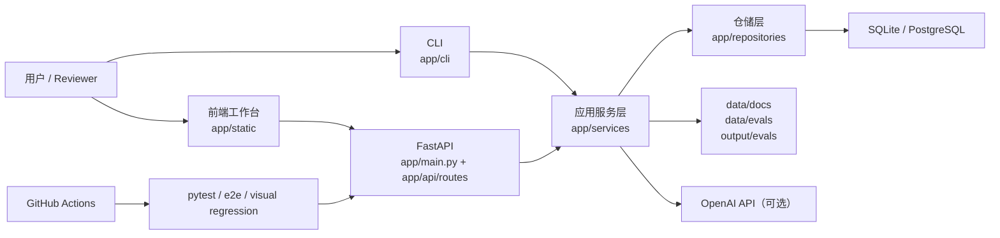

# ARCHITECTURE.md

## 1. 目标与边界

`RAG QA Bench` 当前是一个单机演示优先的 RAG 问答与质量评测平台。

当前架构目标：

- 跑通 `导入文档 -> 切片 -> 嵌入 -> 检索 -> 回答 -> 审计 -> 评测 -> 回归对比` 主链路
- 提供 FastAPI API、CLI 和单页前端工作台三种入口
- 在小规模语料下优先保证可解释性、可测试性和回归稳定性
- 对视觉回归、评测回归和失败诊断形成最小工程闭环

当前明确不做的事情：

- 多租户
- 在线流量治理
- 认证与权限
- 分布式索引与异步任务队列
- 独立迁移平台与灰度系统

## 2. 运行形态

当前仓库支持两种主要运行形态：

| 形态 | 数据库 | 用途 | 说明 |
| --- | --- | --- | --- |
| 默认本地模式 | SQLite | 最快启动、演示、测试 | `app/core/config.py` 默认 `sqlite:///./rag_qa_bench.db` |
| Docker + `.env` 模式 | PostgreSQL + `pgvector` | 更接近真实检索存储 | `.env.example` 默认指向 `postgresql+psycopg://...`，`docker-compose.yml` 提供数据库 |

当前数据库兼容策略：

- SQLite 下，`chunks.embedding` 以 JSON 存储，优先保证本地零依赖可跑通。
- PostgreSQL 下，若 `pgvector` 依赖可用，则 `chunks.embedding` 使用 `pgvector`；否则仍回退到 JSON，避免本地环境因可选依赖缺失直接失效。
- `/v1/health` 会暴露 `database_backend`、`embedding_storage` 和 `feature_flags`，用于确认当前实际运行模式与功能开关状态。

嵌入与生成也有两种主要模式：

- 嵌入默认使用 `hash`，保证本地可复现、无模型下载依赖。
- 当 `EMBEDDING_BACKEND=sentence-transformers` 时切换到本地模型嵌入。
- 当 `OPENAI_API_KEY` 为空时，回答生成使用可解释的抽取式回退生成器。
- 当 `OPENAI_API_KEY` 存在时，回答生成切换到 OpenAI Chat Completions。

当前还提供环境变量级最小特性开关：

- `FEATURE_EVALS_ENABLED=false` 时，评测、对比、报告和运行列表 API 会返回 `503`，前端工作台会禁用实验中心相关入口。
- `FEATURE_REPLAY_EXPERIMENTS_ENABLED=false` 时，bad case 回放与实验对比 API 会返回 `503`，前端会禁用回放实验入口。
- 回放实验开关受评测开关约束；若评测整体关闭，回放也视为关闭。

当前已补最小请求级 observability：

- 所有 HTTP 响应都会返回 `X-Request-ID`；如果调用方已传入该 header，服务会沿用原值。
- 请求日志消息体采用 JSON 负载，最小字段包括 `event`、`request_id`、`method`、`path`、`status_code`、`duration_ms`。
- 核心写操作会额外输出 completion log，当前覆盖 `documents.import.completed`、`qa.ask.completed`、`eval.run.completed`、`eval.replay.completed`。
- `APP_LOG_LEVEL` 控制应用日志级别；当前日志主要输出到进程 stdout/stderr，还没有独立指标导出或 trace 平台。

## 3. 系统上下文

## 4. 分层结构

| 层级 | 目录 | 职责 |
| --- | --- | --- |
| 入口层 | `app/main.py` | 创建 FastAPI 应用、挂载静态资源、初始化数据库、注册路由，并挂接请求级 observability 中间件 |
| API 层 | `app/api/routes` | 暴露问答、文档、评测、健康检查接口 |
| CLI 层 | `app/cli` | 提供文档导入、检索、评测运行与结果查看命令 |
| 服务层 | `app/services` | 承载导入、检索、问答生成、评测与回放等核心业务逻辑 |
| 仓储层 | `app/repositories` | 封装 SQLAlchemy 查询与持久化操作 |
| 数据层 | `app/db` | 定义模型、数据库会话、向量类型兼容逻辑 |
| 运行治理层 | `app/core/observability.py` | 统一请求 ID、请求日志和 completion log 的最小 observability 约定 |
| 协议层 | `app/schemas` | 定义 API 与内部输出的 Pydantic schema |
| 前端层 | `app/static` | 单页工作台与各业务面板脚本 |
| 测试层 | `tests` | 单测、集成、E2E、视觉回归及门禁测试 |
| 数据资产 | `data/` `output/` | 样例文档、评测数据集、快照、报告产物 |

## 5. 关键业务流

### 5.1 文档导入

1. 从 `data/docs` 或指定目录扫描 `.md` / `.txt`
2. 通过 `DocumentIngestionService` 校验文件类型和大小
3. 用 `build_chunks()` 生成分块
4. 调用嵌入提供方计算向量
5. 写入 `documents` / `chunks`
6. 对同一路径文档按 checksum 去重或覆盖更新

### 5.2 问答请求

1. API 或前端把查询发给 `QAService`
2. `ExactRetriever` 基于向量相似度和关键词重叠计算候选分数
3. `assess_evidence()` 评估是否拒答
4. 若证据充分，选择引用块并调用生成器
5. 记录 `answer_runs` 审计数据
6. 返回答案、引用、置信度、拒答原因和 `audit_id`

### 5.3 离线评测与回归

1. `EvaluationService` 从 `data/evals/<dataset>.json` 同步样例
2. 读取 `data/evals/snapshots/*.json` 作为运行时参数覆盖
3. 逐条调用 `QAService`
4. 计算 `hit@5`、`citation_precision@3`、`refusal_accuracy`、`grounded_answer_rate`、`latency_p95_ms`
5. 输出 `output/evals/.../report.json` 与 `report.md`
6. 支持 compare 和 replay experiment 形成回归分析闭环

### 5.4 视觉回归与门禁

1. `tests/test_e2e_visual_regression.py` 覆盖桌面、移动端、平板关键工作流
2. `tests/visual_regression.py` 负责像素比对、失败产物生成和过期产物清理
3. `tests/baselines/manifest.json` 作为正式基线事实源
4. `scripts/render_visual_regression_baselines.py` 负责文档重建和摘要输出
5. GitHub Actions 负责最小同步门禁和视觉 E2E 失败诊断上传

## 6. 核心数据模型

| 模型 | 作用 |
| --- | --- |
| `Document` | 文档元信息、checksum、状态、块数量 |
| `Chunk` | 分块内容、标题路径、向量、顺序 |
| `AnswerRun` | 问答审计记录、引用、失败阶段、耗时、token 与成本 |
| `EvalCase` | 离线评测样例 |
| `EvalRun` | 某次评测运行的汇总与 bad case |
| `ReplayExperiment` | bad case 回放实验与参数覆盖记录 |

当前 schema 已有 Alembic 初始迁移。

当前运行时仍保留 `Base.metadata.create_all()` 兼容层，用于不打断现有本地开发和测试启动链路。

重要限制：

- schema 变更需要通过新的 Alembic 迁移表达
- 运行时启动链路尚未完全切到“只依赖迁移”
- PostgreSQL 下会自动尝试创建 `vector` extension
- PostgreSQL 真实链路仍需在带 `pgvector` 依赖的环境做一次端到端演练

## 7. 存储与目录约定

| 路径 | 用途 |
| --- | --- |
| `data/docs/` | 导入样例文档 |
| `data/evals/` | 离线评测数据集 |
| `data/evals/snapshots/` | 参数快照 |
| `output/evals/` | 评测与对比报告产物 |
| `tests/baselines/` | 视觉基线与 manifest |
| `rag_qa_bench.db` | 默认 SQLite 数据库文件 |

## 8. 设计取舍

- 小规模语料优先使用精确检索，避免在演示阶段引入额外近似索引复杂度。
- 默认 hash embedding 牺牲语义能力，换取零外部依赖、可复现和测试稳定性。
- 生成层优先保证“有证据才回答”，宁可保守拒答，也不追求表面流畅。
- 前端采用单页静态资源形式，降低部署复杂度。
- 视觉回归只覆盖高价值链路，不把所有页面都纳入像素门禁。

## 9. 已知缺口

- 没有认证、权限和租户隔离
- 没有异步任务 / 队列
- 已有最小请求级日志和 request id，但还没有集中式日志、指标聚合或 trace 平台
- 只有环境变量级最小特性开关，还没有更细粒度的灰度与 rollout 机制
- GitHub Actions 覆盖了最小门禁，但还不是完整发布流水线

## 10. 关联文档

- [README.md](README.md)
- [IMPLEMENTATION_PLAN.md](IMPLEMENTATION_PLAN.md)
- [RUNBOOK.md](RUNBOOK.md)
- [docs/visual-regression-baselines.md](docs/visual-regression-baselines.md)
